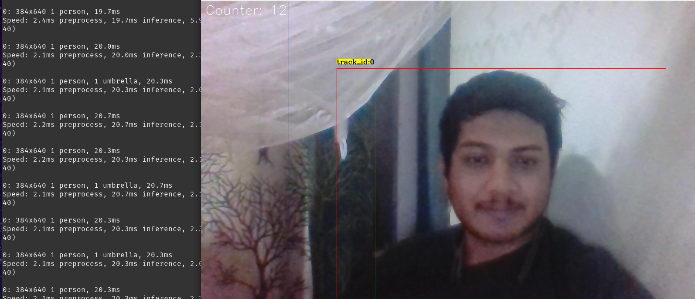

Make a venv (change path if you are serious)

```bash
python3 -m venv yolo ./env
```

Activate it:

```bash
source ./env/bin/activate
```

Install the dependencies (pray to god everything goes well)

```
pip3 install -r requirements.txt
```


Put ths file:
https://drive.google.com/file/d/1qaX1EXo4S1P74JtylJEyCt6-1cyFazEx/view?usp=sharing
in .yolov8_deepsort/deep_sort_pytorch/deep_sort/deep/checkpoint/ckpt.t7


# Showtime

The DeepSORT tracker follows the upper-left corner of the bounding box identified by YOLOv8. When this corner crosses a predefined zone, marked by subtly visible lines, it registers an entry, effectively counting people entering that area.

